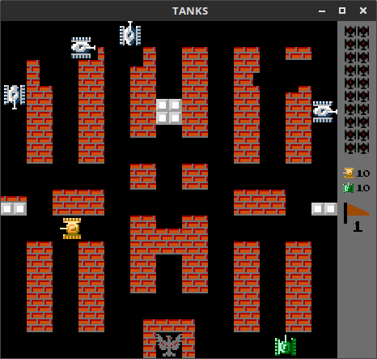
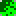

# Tanks

Implementation of Battle City / Tank 1990.
Game was written in C++11 and SDL2 2D graphic library.

## Controls:

 - Player 1: arrows and right CTRL to fire
 - Player 2: WSAD and left CTRL to fire
 - Pause: ENTER
 - Jump to next stage: n
 - Jump to previous stage: b
 - Show targets of enemies: t
 - Fullscreen: F11

## Enemies
Each enemy may fire only one bullet at the same time.
If bullet hits a target, a brick or a stage border and explodes then the enemy may fire next one bullet.
Enemies may have one of four different armour levels. Each level have a different colour.
When a player bullet hits an enemy, it's armor level decrease
If the armour level falls to zero, then enemy will be destroyed.

If enemy blinks, each hit create new bonus item on a map.

### Enemy types

 -  A type:
    - target: closest player or eagle; 
    - speed: base;
    - behaviour: 80% chance to move towards the target, 20% chance to move in random direction, 
      constantly fires in movement direction
 -  B type: 
    - target: eagle; 
    - speed: 1.3 * base; 
    - behaviour: 50% chance to move towards the target, 50% chance to move in random direction,
      constantly fires in movement direction
 -  C type: 
    - target: eagle; 
    - speed: base;
    - behaviour: 50% chance to move towards the target, 50% chance to move in random direction, 
      constantly fires in movement direction
 -  D type:
    - target: closest player or eagle;
    - speed: base;
    - behaviour: 50% chance to move towards the target, 50% chance to move in random direction,
      fires if target is in front of

## Bonus items

 -  Grenade: all enemies are destroyed
 -  Helmet: active player shield for 10 seconds
 -  Clock: freeze all enemies for 8 seconds
 -  Shovel: create stone wall around eagle for 15 seconds
 -  Tank: increase player lives count 
 -  Star: increase player speed, each next one increases max bullets count
 -  Gun: same as three starts
 -  Boat: allows to move on the water

## Levels

Levels are plain text files located in **levels** directory.
Each level is a two-dimensional array with 26 rows and 26 columns.
Each field in the array should be one of following elements:

 - **.** Empty field
 - **#**  Brick wall: it can be destroyed with two bullets or one if you collect three Stars or Gun
 - **@**  Stone wall: it can be destroyed only if you collect three Stars or Gun bonus
 - **%**  Bush: it can be erased only if you collect three Stars or Gun bonus
 - **~**  Water: it is natural obstacle unless you collect Boat bonus
 - **-**  Ice: tanks are slipping on it

## Build

### Linux

#### Requirements

 - make
 - libsdl2-dev
 - libsdl2-ttf-dev
 - libsdl2-image-dev
 - libsdl2-mixer-dev

On Debian based systems you can run (**apt** can by replaced with **apt-get** or **aptitude**):

`sudo apt install libsdl2-dev libsdl2-ttf-dev libsdl2-image-dev libsdl2-mixer-dev` 

### Mac

#### Requirements

 - make
 - sdl2
 - sdl2_ttf
 - sdl2_image
 - sdl2_mixer

`brew install sdl2 sdl2_ttf sdl2_image sdl2_mixer`

#### Compilation

In the project directory run:

`make clean all`

As a result **build** directory should be created.
In **build/bin** there will be **Tanks** binary file with all necessary resources files.

The Tanks has to be run from bin directory otherwise you got black screen.
Have fun.

`cd build/bin && ./Tanks`

Or build and run immediately:

`make clean run`

### Windows

#### Requirements

 - MinGW
 - mingw32-base-bin
 - mingw32-gcc-g++-bin
 - MINGW_HOME environment variable pointing to MinGW directory (eg. C:\MinGW)
 - MinGW bin directory added to **Path** environment variable (eg. C:\MinGW\bin)
 - GitBash or any similar package providing **cp** and **rm** commands

#### Compilation

In the project directory run GitBash and run:

`mingw32-make.exe clean all`

As a result **build** directory should be created.
In **build/bin** there will be **Tanks.exe** binary file with all necessary resources files.
Have fun.

`cd build/bin && ./Tanks.exe`
