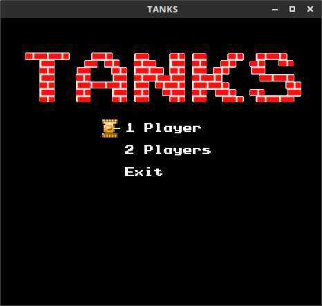
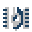
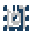
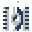
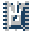
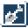

# Tanks

Implementation of Battle City / Tank 1990.
Game was written in C++11 and SDL2 2D graphic library.

## Controls:

 - Player 1: arrows and right CTRL to fire
 - Player 2: WSAD and left CTRL to fire
 - Pause: ENTER
 - Jump to next stage: n
 - Jump to previous stage: b
 - Show targets of enemies: t

## Enemies
Each enemy may fire only one bullet in the same time.
If bullet hits target, brick or stage border and explodes then enemy may fire next one.
Enemies may have one of four different armour levels. Each level have a different colour.
After bullet hit armour level decrease.
If the armour level falls to zero, then enemy is destroyed.

If enemy blinks, each hit create new bonus item on a map.

### Enemy types

 -  A:
    - target: closest player or eagle; 
    - speed: normal: 
    - behaviour: 80% to move towards the target, 20% to move in random direction,
    - constantly fires in movement direction
 -  B: 
    - target: eagle; 
    - speed: 1.3 * normal; 
    - behaviour: 50% to move towards the target, 50% to move in random direction, 
    - constantly fires in movement direction
 -  C: 
    - target: eagle; 
    - speed: normal;
    - behaviour: 50% to move towards the target, 50% to move in random direction, 
    - constantly fires in movement direction
 -  D:
    - target: closest player or eagle;
    - speed: normal;
    - behaviour: 50% to move towards the target, 50% to move in random direction,
    - fires if target is in front of

## Bonus items

 -  Grenade: all enemies are destroyed
 -  Helmet: active player shield for 10 seconds
 -  Clock: freeze all enemies for 8 seconds
 -  Shovel: create stone wall around eagle for 15 seconds
 -  Tank: increase player lives count 
 -  Star: increase player speed, each next one increase max bullets count
 -  Gun: same as three starts
 -  Boat: allows to move on the water
